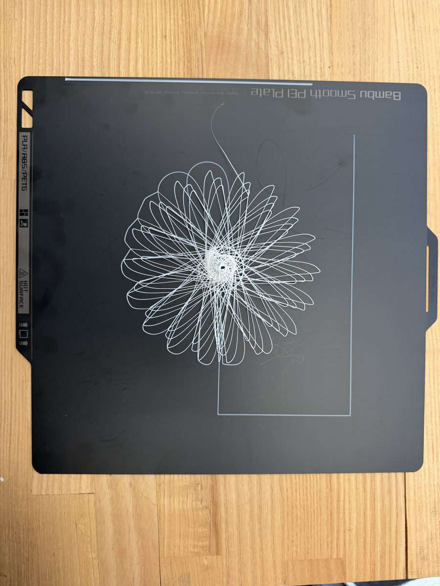

# Bambu G-code Console

A Printrun-style control panel for Bambu Lab printers on your home Wi-Fi: jog the head, set temperatures, type G-code one line at a time, preview a G-code file, stream it line by line, or send it to the SD card and print it with one click. Made for learning how G-code and 3D printers work.

Tested on a **Bambu Lab A1** (firmware 01.08.01.00). Python 3.9+, Windows / macOS / Linux. Inspired by [Printrun](https://github.com/kliment/Printrun), written with [Claude Code](https://claude.com/claude-code), MIT licensed, not affiliated with Bambu Lab. [中文说明 →](README.zh-CN.md)


> **Safety.** This drives a machine with a 220 °C nozzle and moving parts. Stay next to the printer and know where its power switch is. Use at your own risk — see [Disclaimer](#disclaimer).

## Why it exists

Older printers have a USB port that works like a serial cable, so tools like Printrun can send one G-code line and wait for `ok`. A Bambu A1 has no such port. In **LAN-only Mode + Developer Mode** it instead exposes two local network services: **MQTT** (a lightweight "publish a message to a topic" protocol) for commands and **FTPS** (FTP with TLS encryption) for files. This project is a small Python bridge that turns those back into the Printrun experience, with a web page as the front end.

## Features

- **Jog** X / Y / Z in 0.1 – 50 mm steps, Home.
- **Temperatures** live, with one-tap presets and Off.
- **Console**: any G-code, one line per Enter, printer reply shown (`ok` / `FAILED`), command history.
- **File preview**: drop a `.gcode` file, see the XY toolpath (green = extruding, grey = travel) with a layer slider. Arcs (`G2`/`G3`) and any line endings are handled.
- **Stream**: send the file one line at a time with Pause / Stop and live progress. Stop turns heaters and fan off.
- **Print now / Send to SD**: upload to the SD card and start it as a normal print — or just copy it there and start it from the printer's screen. SD file list with Print / Delete, printer Pause / Resume / Stop.
- Finds the printer by itself; remembers the access code after the first successful connection.

A terminal version, `bambu_console.py`, offers the same line-by-line console without the browser.

## Printer setup (once)

1. On the printer: **Settings → Network → LAN-only Mode → on**, let it restart.
2. Same menu: **Developer Mode → on**. (Bambu: it opens MQTT/FTP and disables command verification; no official support in this mode.)
3. Note the 8-character **Access Code** on the LAN-only page (if it is all zeros, toggle LAN-only off and on).
4. Filament loaded, bed levelled once from the printer's own menu.

In LAN-only Mode the Bambu Handy app and cloud features are off; firmware updates go via SD card. Both switches survive updates.

## Run it

Download the repository (**Code → Download ZIP**, or `git clone https://github.com/ChenmingHe0126/bambu-gcode-console.git`), then:

- **Windows:** double-click `start_console.bat`
- **macOS:** double-click `start_console.command` (right-click → Open the first time)
- **Linux / any terminal:** `./start_console.sh`

The launcher installs the one dependency (`paho-mqtt`), starts the bridge at `http://127.0.0.1:8347` and opens your browser. Type the access code and press **Connect**. If the printer is not found, type its IP from the printer's screen (and, if needed, the serial number from *Settings → Device*). Everything is remembered in `~/.bambu-gcode-console.json`; next time it is one click. Closing the terminal window stops the bridge.

```bash
python bambu_web.py --code 12345678     # manual start, options: --ip --serial --port --host --no-browser
python bambu_console.py                 # terminal version
```

## Quick start: a dry run

`examples/square.gcode` traces a 60 mm square **10 mm above the bed — no heating, no filament**. Drop it onto the page, check the preview, press **Stream** and watch the head follow each line (or **Print now** to let the printer run it by itself).

```gcode
G28                       ; home all axes - the printer must know where it is before any move
G90                       ; absolute coordinates: X/Y/Z are positions on the bed, not offsets
G1 Z10 F1200              ; lift to 10 mm (F1200 = 1200 mm/min = 20 mm/s)
G1 X98 Y98 F6000          ; travel to the first corner (bed is 256 x 256 mm, so this is centred)
G1 X158 Y98 F3000         ; side 1 -> right   (60 mm at 50 mm/s)
G1 X158 Y158              ; side 2 -> back    (F is remembered until you change it)
G1 X98 Y158               ; side 3 -> left
G1 X98 Y98                ; side 4 -> front, square closed
G1 Z30 F1200              ; lift away
G1 X128 Y128 F6000        ; park over the middle of the bed
M400                      ; wait until every move above has finished
```

- `G28` homes; `G90` makes every coordinate absolute.
- `G1` moves in a straight line; `F` is the speed in mm/min and stays in effect until changed.
- Nothing here has an `E` value, so the extruder never turns. Printing in plastic adds heating (`M104`, `M140`), a first-layer height of `Z0.2` and an `E` amount per move — the other examples do exactly that.

When you are ready for plastic, `examples/star.gcode` and `examples/hello_world.gcode` are complete single-layer prints (they include the start sequence that heats, homes and purges, and the end sequence that cools down). Edit the temperatures in `A1_start_minimal.gcode` to match your filament.

| | | |
|:-:|:-:|:-:|
|  |  |  |
| `star.gcode` | `hello_world.gcode` | a spirograph from the same workflow |

| File | What it is |
|---|---|
| `examples/square.gcode` | Dry run above: no heat, no filament. |
| `examples/star.gcode` | Single-layer star in PLA, ~2 400 lines. |
| `examples/hello_world.gcode` | "Hello World" in PLA, ~4 000 lines. |
| `examples/A1_start_minimal.gcode` / `A1_end_minimal.gcode` | Minimal A1 start / end sequences used by the prints above. |

## How it works

```
browser  ──HTTP, localhost:8347──▶  bambu_web.py  ──MQTT over TLS :8883──▶  printer
                                          └────────FTPS :990────────────▶  SD card
```

- Each command is a JSON message on the printer's MQTT topic; a G-code line travels as `{"print":{"command":"gcode_line","param":"G28\n"}}`. The printer replies "accepted" — never command output, so `M114`-style read-backs are impossible on this firmware. Temperatures and state arrive as periodic status pushes.
- **Print now** works around a firmware rule: remote starts (`project_file`) only execute `.gcode.3mf` files with Bambu Studio's structure. Your G-code is injected into `a1_skeleton.gcode.3mf` — a genuine Studio export of a 10 mm cube — and started; Studio exports are sent unchanged. Credits: [OpenBambuAPI](https://github.com/Doridian/OpenBambuAPI), [ha-bambulab](https://github.com/greghesp/ha-bambulab), [bambulabs_api](https://github.com/acse-ci223/bambulabs_api), [bambuddy](https://github.com/maziggy/bambuddy), [open-bamboo-networking](https://github.com/ClusterM/open-bamboo-networking).

## Troubleshooting

| Symptom | Fix |
|---|---|
| *connection refused* | Wrong access code or Developer Mode off. Re-read the code; restart the printer after toggling the modes. |
| *Printer not found* | Broadcast discovery blocked (Windows "Public" network, some routers). Enter the IP, then the serial if needed. Close Bambu Studio / OrcaSlicer, which hold the discovery port. |
| Commands say `ok`, nothing happens; screen says *device is busy* | Firmware job manager stuck — power-cycle the printer. |
| *FTP upload failed: timed out* | The printer closes FTP connections late; the upload usually completed. Press Refresh. |
| *port 8347 unavailable* | Another console window is open; close it or use `--port 8350`. |
| Printer shows `FAILED` after Stop | Bambu's word for "cancelled"; the next print starts normally. |
| Remote print never starts on a non-A1 | Slice any small object for your printer in Bambu Studio, export `.gcode.3mf`, replace `a1_skeleton.gcode.3mf`. |

## Notes

- `--host 0.0.0.0` makes the page reachable by everyone on the network, with no password. Only the browser on the bridge's own machine ever receives the access code, but anyone else can still move and heat the printer. Use on a trusted network only.
- The access code is stored in plain text in `~/.bambu-gcode-console.json`; delete the file on shared computers.
- TLS certificate checks are disabled for the printer (Bambu uses a private CA).
- Stream waits for an acknowledgement per line, but the printer buffers moves, so Pause acts a few moves late. It is for short files, not 50 000-line prints.

## Disclaimer

Hobby software provided "as is", without warranty of any kind. It uses an unofficial interface that Bambu Lab may change at any time; Developer Mode is outside Bambu's support. You are responsible for whatever the printer does while this tool is connected.

## License

[MIT](LICENSE) © 2026 Chenming He
