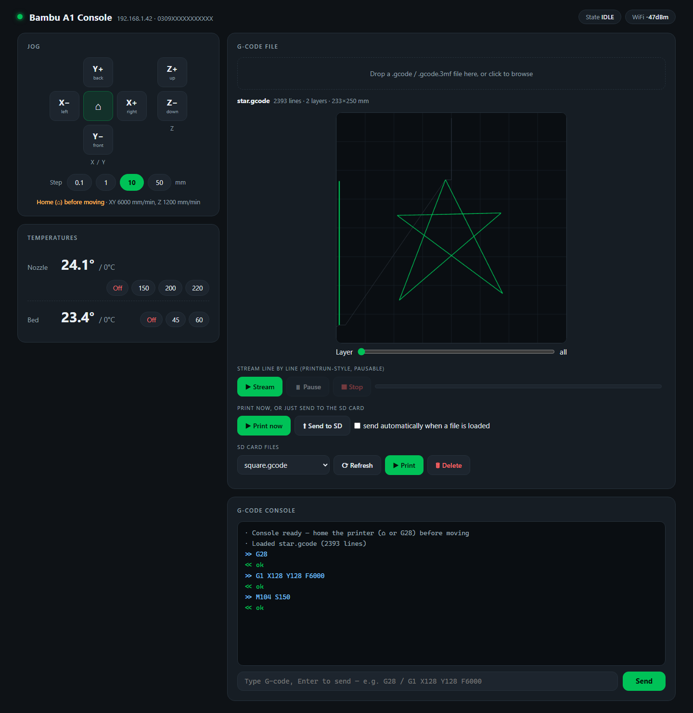
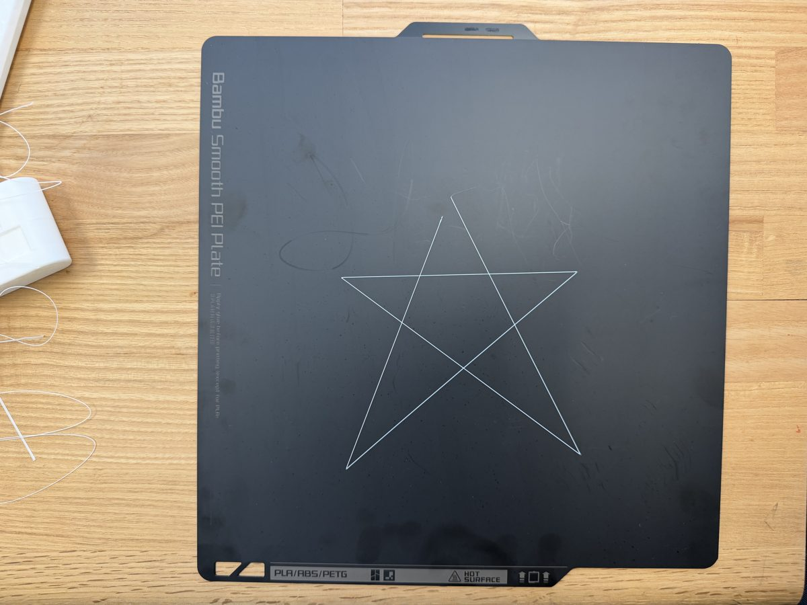
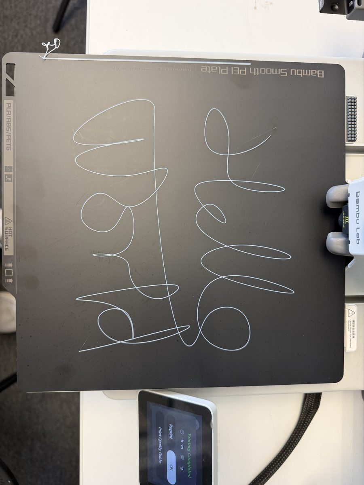

# Bambu G-code Console(中文说明)

一个 Printrun 风格的 Bambu Lab 打印机控制面板,在家连同一个 Wi-Fi 就能用:点动喷头、设温度、一行一行输入 G-code、预览 G-code 文件、逐行流式发送,或者一键传进 SD 卡开始打印。为学习 G-code 和 3D 打印机的工作原理而写。

在 **Bambu Lab A1**(固件 01.08.01.00)上实测。Python 3.9+,Windows / macOS / Linux。功能参考 [Printrun](https://github.com/kliment/Printrun),用 [Claude Code](https://claude.com/claude-code) 编写,MIT 许可证,与 Bambu Lab 无关。[English →](README.md)



> **安全提示。** 它驱动的是一台喷嘴 220 °C、会运动的机器。请守在打印机旁,知道电源开关在哪。风险自负,见[免责声明](#免责声明)。

## 为什么会有它

老式打印机有一个相当于串口线的 USB 口,Printrun 这类工具可以发一行 G-code、等一个 `ok`。Bambu A1 没有这个口。但在**仅局域网模式 + 开发者模式**下,它会在局域网里开放两个服务:**MQTT**(一种"往某个主题发消息"的轻量协议)负责指令,**FTPS**(加了 TLS 加密的 FTP)负责文件。本项目就是一个小小的 Python 桥,把这两条通道重新变回 Printrun 的体验,前端是一个网页。

## 功能

- **点动** X / Y / Z,步进 0.1 – 50 mm,归零。
- **温度**实时显示,一键预设和关闭。
- **控制台**:任意 G-code,一行一回车,显示打印机回复(`ok` / `FAILED`),有历史记录。
- **文件预览**:拖入 `.gcode`,看 XY 走刀图(绿色 = 挤出,灰色 = 空移),带层滑块。支持圆弧(`G2`/`G3`)和各种换行符。
- **Stream**:一行一行发送文件,可暂停 / 停止,实时进度。停止时自动关闭加热器和风扇。
- **Print now / Send to SD**:上传到 SD 卡并作为正常打印任务启动——或者只是拷过去,在打印机屏幕上启动。SD 文件列表可打印 / 删除,打印机暂停 / 继续 / 停止。
- 自动找到打印机;首次连接成功后记住访问码。

终端版 `bambu_console.py` 提供同样的逐行控制台,不需要浏览器。

## 打印机设置(只做一次)

1. 打印机上:**设置 → 网络 → 仅局域网模式 → 开**,让它重启。
2. 同一菜单:**开发者模式 → 开**。(Bambu 的说法:开放 MQTT/FTP 并关闭指令校验;此模式无官方售后。)
3. 记下 LAN-only 页面上的 8 位**访问码**(全 0 的话把 LAN-only 关掉再打开)。
4. 装好耗材,在打印机自己的菜单里调平过一次热床。

仅局域网模式下 Bambu Handy App 和云功能不可用;固件通过 SD 卡升级。两个开关跨升级保留。

## 运行

下载仓库(**Code → Download ZIP**,或 `git clone https://github.com/ChenmingHe0126/bambu-gcode-console.git`),然后:

- **Windows:** 双击 `start_console.bat`
- **macOS:** 双击 `start_console.command`(第一次要右键 → 打开)
- **Linux / 任何终端:** `./start_console.sh`

启动器会装好唯一的依赖(`paho-mqtt`),在 `http://127.0.0.1:8347` 起桥并打开浏览器。输入访问码,按 **Connect**。找不到打印机时,填打印机屏幕上的 IP(必要时再填 *设置 → 设备信息* 里的序列号)。这些都记在 `~/.bambu-gcode-console.json`,下次一键即可。关掉终端窗口即停止。

```bash
python bambu_web.py --code 12345678     # 手动启动,可选参数:--ip --serial --port --host --no-browser
python bambu_console.py                 # 终端版
```

## 快速上手:空走一遍

`examples/square.gcode` 在**离床 10 mm 的高度**沿一个 60 mm 的方形走一圈——**不加热、不出丝**。把它拖到页面上,看预览,按 **Stream** 看喷头一行一行照做(或按 **Print now** 让打印机自己跑)。

```gcode
G28                       ; 全部归零——移动之前打印机必须先知道自己在哪
G90                       ; 绝对坐标:X/Y/Z 是床面上的位置,不是增量
G1 Z10 F1200              ; 抬到 10 mm(F1200 = 1200 mm/min = 20 mm/s)
G1 X98 Y98 F6000          ; 空移到第一个角(床面 256 x 256 mm,所以这是居中的)
G1 X158 Y98 F3000         ; 第 1 边 -> 右(60 mm,50 mm/s)
G1 X158 Y158              ; 第 2 边 -> 后(F 一直沿用,直到你改它)
G1 X98 Y158               ; 第 3 边 -> 左
G1 X98 Y98                ; 第 4 边 -> 前,方形闭合
G1 Z30 F1200              ; 抬离
G1 X128 Y128 F6000        ; 停到床面中央上方
M400                      ; 等上面所有动作都完成
```

- `G28` 归零;`G90` 让之后的坐标都是绝对值。
- `G1` 是直线移动;`F` 是速度(mm/min),改之前一直有效。
- 这里没有任何 `E` 值,所以挤出机不会转。要真打出塑料,就要加上加热(`M104`、`M140`)、第一层高度 `Z0.2`,以及每一步的 `E` 挤出量——另外几个示例就是这么做的。

准备好上料了,`examples/star.gcode` 和 `examples/hello_world.gcode` 是完整的单层打印文件(自带加热、归零、清料的起始段和降温的结束段)。按你的耗材改 `A1_start_minimal.gcode` 里的温度。

| | |
|:-:|:-:|
|  |  |
| `star.gcode` | `hello_world.gcode` |

| 文件 | 内容 |
|---|---|
| `examples/square.gcode` | 上面的空走:不加热、不出丝。 |
| `examples/star.gcode` | PLA 单层五角星,约 2 400 行。 |
| `examples/hello_world.gcode` | PLA 的 "Hello World",约 4 000 行。 |
| `examples/A1_start_minimal.gcode` / `A1_end_minimal.gcode` | 上面两个打印文件用到的 A1 最小起始 / 结束段。 |
| `examples/grasshopper/Gcode.gh` | 生成上面星星和 Hello World 的 Grasshopper 定义(见下)。 |

### 自己做:Grasshopper 模板

`examples/grasshopper/Gcode.gh` 能把 Rhino 里画的任意曲线变成单层 G-code 文件。需要 Rhino 7/8 + Grasshopper,只用标准组件(不需要插件)。它的流程:

1. 在 Rhino 的 XY 平面上画一条曲线,放在床面范围内(256 × 256 mm,原点在左前角),用 `Curve` 参数引用它。
2. `Divide Curve` 把曲线采样成很多小段(滑块控制数量;直线几百段就够,拐角会保留)。
3. 每一段的长度乘以一个"每毫米耗材量"系数,得到它的 `E` 值——和方形示例里的算法一样(线宽 × 层高 ÷ 耗材截面积 ≈ 0.037)。两个滑块用来标定;想要线粗一点就调大系数。
4. 点坐标和 `E` 值被拼成 `G1 X.. Y.. Z0.2 E..`,前面加上第一条空移,再用 Merge 把起始段和结束段(两个文本面板,内容和 `A1_start_minimal` / `A1_end_minimal` 相同)包在外面。
5. 把输出面板的文字复制到一个文本文件里,命名为 `xxx.gcode`,拖进控制台,看预览,打印。

## 工作原理

```
浏览器  ──HTTP, localhost:8347──▶  bambu_web.py  ──MQTT over TLS :8883──▶  打印机
                                         └────────FTPS :990────────────▶  SD 卡
```

- 每条指令是发到打印机 MQTT 主题上的一条 JSON;一行 G-code 长这样:`{"print":{"command":"gcode_line","param":"G28\n"}}`。打印机只回"已受理",从不返回指令输出,所以这个固件上做不到 `M114` 这类回读。温度和状态靠周期性的状态推送。
- **Print now** 绕过了一条固件规则:远程启动(`project_file`)只执行 Bambu Studio 结构的 `.gcode.3mf`。你的 G-code 会被注入 `a1_skeleton.gcode.3mf`——一个 Studio 真实导出的 10 mm 立方体——再启动;Studio 导出的文件原样发送。致谢:[OpenBambuAPI](https://github.com/Doridian/OpenBambuAPI)、[ha-bambulab](https://github.com/greghesp/ha-bambulab)、[bambulabs_api](https://github.com/acse-ci223/bambulabs_api)、[bambuddy](https://github.com/maziggy/bambuddy)、[open-bamboo-networking](https://github.com/ClusterM/open-bamboo-networking)。

## 排障

| 现象 | 处理 |
|---|---|
| *connection refused* | 访问码错了或开发者模式没开。重新读码;切换过模式后重启打印机。 |
| *Printer not found* | 广播发现被拦(Windows"公用"网络、部分路由器)。填 IP,必要时再填序列号。关掉 Bambu Studio / OrcaSlicer,它们占着发现端口。 |
| 指令回 `ok` 但没动静;屏幕显示 *device is busy* | 固件任务管理器卡住——给打印机断电重启。 |
| *FTP upload failed: timed out* | 打印机关 FTP 连接关得晚,上传通常已完成。按 Refresh。 |
| *port 8347 unavailable* | 另一个控制台窗口还开着;关掉它,或用 `--port 8350`。 |
| 按 Stop 后打印机显示 `FAILED` | 这是 Bambu 对"已取消"的叫法;下次打印正常。 |
| 非 A1 机型远程打印不启动 | 在 Bambu Studio 里给你的机型切任意小物体,导出 `.gcode.3mf`,替换 `a1_skeleton.gcode.3mf`。 |

## 注意

- `--host 0.0.0.0` 会让网络里所有人都能打开页面,且没有密码。访问码只会给桥所在电脑上的浏览器,但别人仍然能移动和加热打印机。只在可信的网络里用。
- 访问码明文存在 `~/.bambu-gcode-console.json`;共用电脑上用完删掉。
- 对打印机的 TLS 证书校验是关闭的(Bambu 用私有 CA)。
- Stream 每行等一次受理回执,但打印机会缓冲移动,所以暂停会晚几步生效。它适合短文件,不适合 5 万行的打印。

## 免责声明

业余软件,按"现状"提供,不附带任何形式的保证。它使用的是 Bambu Lab 随时可能更改的非官方接口;开发者模式不在 Bambu 售后范围内。本工具连接期间打印机做的任何事都由你自己负责。

## 许可证

[MIT](LICENSE) © 2026 Chenming He
